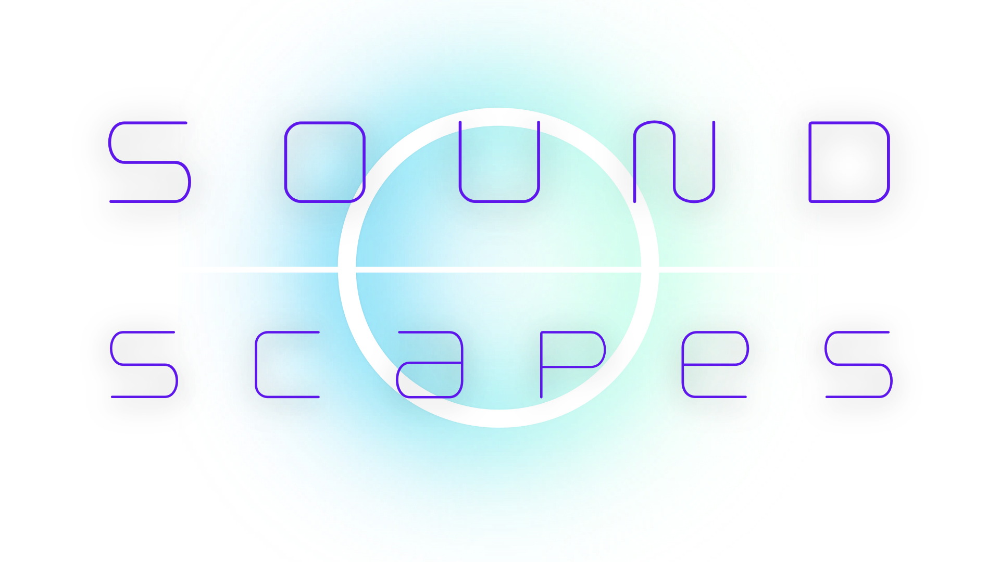

# 🎵 SoundScapes - Interactive Music Sequencer

<div align="center">
  
  
  <p>
    <a href="https://isacaputo.github.io/soundscapes">
      
    </a>
  </p>
  
  <p>
    <a href="https://reactjs.org/">
      
    </a>
    <a href="https://tonejs.github.io/">
      
    </a>
  </p>
  
  <p>
    <a href="https://vitejs.dev/">
      
    </a>
  </p>
</div>

## About

SoundScapes is a **web-based interactive music sequencer** that allows users to create and experiment with musical sequences in real-time. Built with modern web technologies, it provides an intuitive interface for music creation with multiple instruments, effects, and customization options.


### Key Features

- 🎹 **Dual Sequencer System** - Main and background sequences playing simultaneously
- 🎵 **Multiple Instruments** - Piano, Basic Synth, and AM Synth options
- 🎚️ **Audio Effects** - Tremolo and Reverb with adjustable intensity
- 🔊 **Volume Control** - Independent volume adjustment for each sequence
- 🎼 **Pre-built Sequences** - Two example sequences to get started quickly

### Live Demo

Experience SoundScapes live: **[https://isacaputo.github.io/soundscapes](https://isacaputo.github.io/soundscapes)**

## 🛠️ Tech Stack

### Frontend

- **[React 18.2.0](https://reactjs.org/)** - Modern UI library with hooks and context
- **[Vite 4.3.2](https://vitejs.dev/)** - Fast build tool and development server
- **[Material-UI 5.13.4](https://mui.com/)** - React component library for modern UI

### Audio Engine

- **[Tone.js 14.8.49](https://tonejs.github.io/)** - Web Audio framework for interactive music

### Development Tools

- **[ESLint](https://eslint.org/)** - Code linting and formatting
- **[Prettier](https://prettier.io/)** - Code formatting
- **[GitHub Pages](https://pages.github.com/)** - Deployment platform

## 🎼 Musical Features

### Sequencer Capabilities

- **Main Sequence**: 4 notes per compass × 8 compasses (32 total notes)
- **Background Sequence**: 1 note per compass × 8 compasses (8 total notes)
- **Real-time Playback**: Synchronized playback of both sequences
- **Visual Feedback**: Interactive grid with active note highlighting

### Instruments

| Instrument      | Description               | Use Case                        |
| --------------- | ------------------------- | ------------------------------- |
| **Piano**       | Classic piano sound       | Melodic sequences and harmony   |
| **Basic Synth** | Clean synthesizer tone    | Electronic music and bass lines |
| **AM Synth**    | Amplitude modulated synth | Textural and atmospheric sounds |

### Audio Effects

- **Tremolo**: Amplitude modulation effect with adjustable frequency
- **Reverb**: Spatial effect with adjustable decay time
- **Volume Control**: Independent mixing for main and background sequences

## 🚀 Getting Started

### Prerequisites

- Node.js (v14 or higher)
- npm or yarn package manager

### Installation

1. **Clone the repository**

   ```bash
   git clone https://github.com/isacaputo/soundscapes.git
   cd soundscapes
   ```

2. **Install dependencies**

   ```bash
   npm install
   ```

3. **Start the development server**

   ```bash
   npm run dev
   ```

4. **Open your browser**
   Navigate to `http://localhost:5173` to see the application running.

### Building for Production

```bash
# Build the project
npm run build

# Preview the build locally
npm run preview
```

### Deployment to GitHub Pages

```bash
# Deploy to GitHub Pages
npm run deploy
```

## 🎯 Usage Guide

### Creating Your First Sequence

1. **Select an Instrument**: Choose from Piano, Basic Synth, or AM Synth
2. **Build Your Sequence**: Click on the grid to activate notes
3. **Add Background**: Create a complementary background sequence
4. **Apply Effects**: Adjust Tremolo and Reverb to taste
5. **Control Volume**: Balance your main and background sequences
6. **Press Play**: Enjoy your creation!

### Tips for Better Sequences

- Start with a simple 4-note pattern in the main sequence
- Use the background sequence for bass lines or atmospheric pads
- Experiment with different instruments for varied textures
- Apply subtle effects to enhance the overall sound

## 📁 Project Structure

```
soundscapes/
├── public/
│   ├── images/          # Logo and visual assets
│   └── vite.svg
├── src/
│   ├── components/      # React components
│   │   ├── AppContent.jsx
│   │   ├── Header.jsx
│   │   ├── InstrumentSelector.jsx
│   │   ├── ControlsSection.jsx
│   │   └── ...
│   ├── contexts/        # React context providers
│   │   ├── audio/       # Audio state management
│   │   └── playback/    # Playback control
│   ├── helpers/         # Utility functions and constants
│   └── main.jsx         # Application entry point
├── package.json
├── vite.config.js
└── README.md
```

## 🤝 Contributing

Contributions are welcome! Please feel free to submit a Pull Request. For major changes, please open an issue first to discuss what you would like to change.

### Development Workflow

1. Fork the repository
2. Create your feature branch (`git checkout -b feature/AmazingFeature`)
3. Commit your changes (`git commit -m 'Add some AmazingFeature'`)
4. Push to the branch (`git push origin feature/AmazingFeature`)
5. Open a Pull Request

## 📚 API Reference

### Tone.js Integration

This project leverages the powerful Tone.js Web Audio framework. For detailed API documentation, visit:
[Tone.js Documentation](https://tonejs.github.io/docs/14.7.77/index.html)

### Key Tone.js Features Used

- **Synthesizers**: Piano, AM Synth, Basic Synth
- **Effects**: Tremolo, Reverb
- **Transport**: Global timing and synchronization
- **Sequencing**: Pattern-based note scheduling

## Acknowledgments

- [Tone.js](https://tonejs.github.io/) for the amazing Web Audio framework
- [Material-UI](https://mui.com/) for the beautiful React components
- [Vite](https://vitejs.dev/) for the fast development experience
- [React](https://reactjs.org/) for the powerful UI library

---

<div align="center">
  <p>Made with ❤️ and 🎵 by Isadora Caputo</p>
  <p>
    <a href="https://isacaputo.github.io/soundscapes">Try SoundScapes Now</a>
  </p>
</div>
