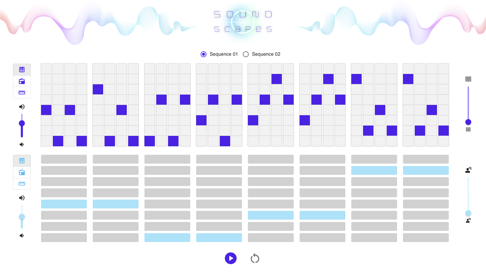

# SoundScapes - Music Sequencer

SoundScapes is a **web-based music sequencer** to interactively create sequences of sound with different options for instruments and effects.

## About the project

SoundScapes is a frontend project built with React to provide the possibility of delivering music according to user inputs.
The project use **Tone.js** as the _Web Audio Framework_ for creating interactive music in the browser.

**Tech Stack**

> **Tone.js** for creating synthesizers and effects;

> **React** for the user interface;

> **Express** and **Node** for the server side / application layer;

Sound llibrary >> [API documentation Tone.js](https://tonejs.github.io/docs/14.7.77/index.html)

> Tone.js is a Web Audio framework for creating interactive music in the browser. The architecture of Tone.js aims to be familiar to both musicians and audio programmers creating web-based audio applications. On the high-level, Tone offers common DAW (digital audio workstation) features like a global transport for synchronizing and scheduling events as well as prebuilt synths and effects. Additionally, Tone provides high-performance building blocks to create your own synthesizers, effects, and complex control signals.

## Client side

- **React Router** for the client side routing;
- **React Context** for sharing data across multiple components;
- **Vite** as a local development server for providing better performance for the web application;
- **Material UI** as the React component library.

## Current features

The front currently has the following features:

**Oscillator**

A basic oscillator sound source + the option to add more than one oscillator choosing the frequency by user.

**Sequencer**

A few sequencer options with the Synth type of sound ([Synth](https://tonejs.github.io/docs/14.7.77/Synth)).
Sequences options:

- Initial sequence (seq 1)
- Second sequence (seq 2)
