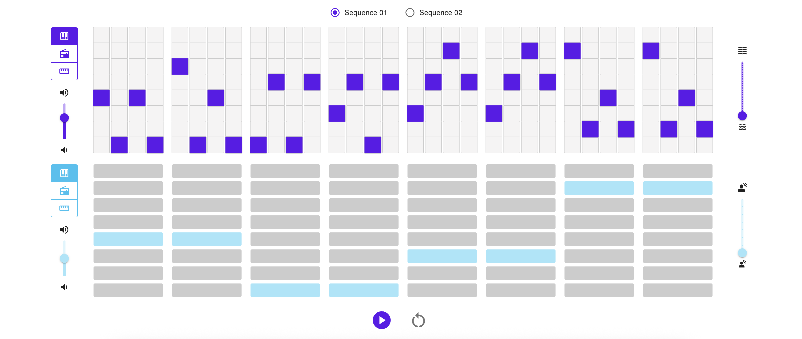

# SoundScapes - Music Sequencer

SoundScapes is a **web-based music sequencer** with a interactive interface to create sequences of sound with different options of instruments and effects.

## About the project

SoundScapes is a frontend project built with React to provide the possibility of delivering music according to user inputs.
The project use **Tone.js** as the _Web Audio Framework_ for creating interactive music in the browser.

Tech Stack:

> **Tone.js** for creating synthesizers and effects;

> **React** for the user interface;

> **Express** and **Node** for the server side / application layer;

To install:

Run `npm install tone@next`

To import Tone.js:

`import * as Tone from 'tone'`

Sound llibrary >> [API documentation Tone.js](https://tonejs.github.io/docs/14.7.77/index.html)

> Tone.js is a Web Audio framework for creating interactive music in the browser. The architecture of Tone.js aims to be familiar to both musicians and audio programmers creating web-based audio applications. On the high-level, Tone offers common DAW (digital audio workstation) features like a global transport for synchronizing and scheduling events as well as prebuilt synths and effects. Additionally, Tone provides high-performance building blocks to create your own synthesizers, effects, and complex control signals.

## Current features

The front currently has the following features:

**Oscillator**

A basic oscillator sound source + the option to add more than one oscillator choosing the frequency by user.

**Sequencer**

A few sequencer options with the Synth type of sound ([Synth](https://tonejs.github.io/docs/14.7.77/Synth)).

Sequences options:

Initial sequence (seq 1)

Second sequence (seq 2)

Random generated sequences (random seq)

Optional manual change sequence (all)

The optional manual change sequence displays the notes of the current sequence + the buttons to change up and down each note and octave (3).

## Future features!

Effects and modulation to add (loop, reverb..)

Sounds (harmonic oscillation, noise, texture sound)

Samples

Add a Save feature (back) and a Replay feature

Add the PLAY/STOP functions

Styling (css + tailwind?)
